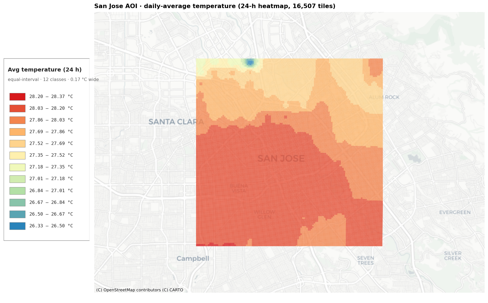

# Temperature API Quickstart

A Python + Jupyter sandbox for the [FortyGuard tOS Enterprise API](https://api.fortyguard.com). Drop in your API key and run a notebook — you'll get a heatmap, a heat-intelligence PDF, or an environmental-parameter time series in minutes.

The `fortyguard/` package wraps every endpoint the API exposes and handles the submit-then-poll pattern for you. The `notebooks/` folder walks you through each endpoint with runnable examples, and `notebooks/use_cases/` shows full narrative workflows that combine your own data with FortyGuard layers to produce a defensible action list.



*Above: the bundled 24-hour heatmap rendered tile-by-tile — daily mean (left) and daily peak (right) across ~16,500 tiles. The southeast urban heat island is exactly the kind of pattern the use-case notebooks pick up when they join your point list against this layer.*


*And the one-line summary card every use-case notebook prints right after loading the heatmap — min / mean / max swatches, a colored histogram of every tile's peak, and a continuous colorbar.*

---

## What you can do here

### Endpoint walkthroughs

| # | Notebook | Endpoint | Plan |
|---|----------|----------|------|
| 00 | [Setup & authentication](notebooks/00_setup.ipynb) | `POST /v1/system/fetch-api-key-usage` | Both |
| 01 | [Create heatmap](notebooks/01_create_heatmap.ipynb) | `POST /v1/heatmap` | Both |
| 02 | [Environmental parameters](notebooks/02_environmental_parameters.ipynb) | `POST /v1/env_params` | Both |
| 03 | [Satellite segmentation](notebooks/03_satellite_segmentation.ipynb) | `POST /v1/satellite` | Premium |
| 04 | [Street view segmentation](notebooks/04_street_view_segmentation.ipynb) | `POST /v1/streetview` | Premium |
| 05 | [Heat intelligence report](notebooks/05_heat_intelligence_report.ipynb) | `POST /v1/heat_intelligence` | Premium |

All analysis endpoints are asynchronous: you submit a request, get an `activity_id`, and poll `GET /v1/status/{activity_id}` until the task finishes. The client does the polling for you — you just call `client.create_heatmap(...)` and get the result back.

### Use-case notebooks

Once you've completed `00_setup.ipynb`, jump into a narrative workflow that combines **your own data** with FortyGuard layers to produce a ranked, defensible action list. See [`notebooks/use_cases/`](notebooks/use_cases/README.md) for the full index. The three available today:

| Persona / industry | Your data | Output |
|-------------------|-----------|--------|
| [Real-estate portfolio heat risk](notebooks/use_cases/real_estate_portfolio_heat_risk.ipynb) | Property portfolio | Client-deck slide pack (M1/M2/M3 maps) + per-property action brief citing public programs (EPA, USDA, ASHRAE, OSHA) |
| [Urban planner — bus-stop cooling](notebooks/use_cases/urban_planner_bus_stop_prioritization.ipynb) | Bus-stop points | Ranked intervention list |
| [Public-parks heat-resilience audit](notebooks/use_cases/public_parks_heat_resilience_audit.ipynb) | Park points (id + type + acres + lat/lon) | Per-park audit with declarative, threshold-triggered recommendations citing federal programs |

Each notebook ships with sample data in `data/` — drop in your own CSV with matching columns and everything downstream works.


*Example output from the public-parks audit: a satellite-segmentation stacked bar tells the parks director why each top park is hot — the building, road, and tree shares feed straight into threshold-triggered recommendations like "USDA Forest Service i-Tree planting plan" or "EPA Heat Island Reduction cool-pavement retrofit".*

---

## Prerequisites

- Python 3.10 or newer
- A FortyGuard API key (Basic or Premium tier)
- About 5 minutes

---

## Getting started

### 1. Clone and create a virtual environment

```bash
git clone <this-repo> temperature-api-quickstart
cd temperature-api-quickstart

python -m venv venv
# Windows
venv\Scripts\activate
# macOS / Linux
source venv/bin/activate
```

### 2. Install dependencies

```bash
pip install -r requirements.txt
```

### 3. Add your API key

```bash
cp .env.example .env
```

Open `.env` and paste your key:

```env
FORTYGUARD_API_KEY=fg_live_xxxxxxxxxxxxxxxx
FORTYGUARD_BASE_URL=https://api.fortyguard.com
```

> The `.env` file is git-ignored — your key will not be committed.

### 4. Launch Jupyter

```bash
jupyter lab
```

Open `notebooks/00_setup.ipynb` and run every cell top-to-bottom. If the last cell prints your plan and remaining credits, you're wired up. Continue through the remaining notebooks in order, then pick a use-case workflow.

---

## Using the Python client directly

Outside a notebook:

```python
from dotenv import load_dotenv; load_dotenv()
from fortyguard import FortyGuardClient

client = FortyGuardClient()  # picks up FORTYGUARD_API_KEY from .env

response = client.create_heatmap(
    polygon_aoi={
        "type": "FeatureCollection",
        "features": [{
            "type": "Feature", "properties": {},
            "geometry": {
                "type": "Polygon",
                "coordinates": [[
                    [-74.017, 40.705], [-74.003, 40.705],
                    [-74.003, 40.718], [-74.017, 40.718],
                    [-74.017, 40.705],
                ]],
            },
        }],
    },
    start_date="2024-07-15",
    start_time="14:00",
    filter_type=1,        # 1=single hour, 2=range, 3=single day
    granularity=100,      # meters: 60, 80, or 100
)

print(response["activity_id"])
print(response["result"]["stats_data"])
```

Every endpoint has its own method:

| Method | What it does |
|--------|--------------|
| `client.create_heatmap(...)` | Thermal map over a polygon AOI |
| `client.environmental_parameters(...)` | Heat index, AQI, solar irradiance at a point |
| `client.satellite_segmentation(...)` | Land-cover classes from a satellite tile *(Premium)* |
| `client.street_view_segmentation(...)` | Segmentation of a ground-level view *(Premium)* |
| `client.heat_intelligence(...)` | Multi-dimensional PDF report *(Premium)* |
| `client.fetch_api_key_usage()` | Current billing cycle summary |
| `client.fetch_api_key_custom_usage(start_date, end_date)` | Usage over a custom window |
| `client.get_status(activity_id)` | Raw status of a submitted task |
| `client.wait_for(activity_id)` | Block until a task terminates |

Pass `wait=False` to any analysis method to get the `activity_id` immediately and poll it yourself.

---

## Project layout

```
temperature-api-quickstart/
├── README.md                 # this file
├── requirements.txt          # pinned dependencies
├── .env.example              # template — copy to .env
├── docs/
│   └── images/               # README screenshots
├── fortyguard/               # Python client
│   ├── client.py             # FortyGuardClient — one method per endpoint
│   ├── exceptions.py         # FortyGuardError, TaskFailedError, TaskTimeoutError
│   └── samples.py            # sample polygons and points for demos
├── data/                     # sample user datasets + cached API responses
│   ├── sample_bus_stops.csv
│   ├── sample_public_parks.csv
│   ├── real_estate_san_jose_portfolio_sample.csv
│   └── real_state_san_jose_*.{json,geojson,pdf}   # 24-h heatmap, env-params, satellite, street-view, heat-intelligence samples
├── outputs/                  # generated artifacts (PDFs, action-list CSVs) — gitignored
└── notebooks/
    ├── 00_setup.ipynb                     # endpoint reference — run first
    ├── 01_create_heatmap.ipynb ... 05_heat_intelligence_report.ipynb
    └── use_cases/                         # narrative workflows (your data × FortyGuard layers)
        ├── README.md
        ├── real_estate_portfolio_heat_risk.ipynb
        ├── urban_planner_bus_stop_prioritization.ipynb
        └── public_parks_heat_resilience_audit.ipynb
```

---

## Useful things to know

- **Coordinates are `[longitude, latitude]`** in GeoJSON — not the other way around.
- **Filter types** for endpoints that take `date_time`: `1` = single hour, `2` = range of hours, `3` = single day.
- **Failed tasks are free.** Credits are only deducted once a task reaches `succeeded`.
- **Heat intelligence returns a PDF**, not JSON. The client streams it to `outputs/` and returns the file path.
- **Cached mode for use-case notebooks.** Every use-case notebook ships with `CACHED=True` and the bundled `data/real_state_san_jose_*` files, so you can run them end-to-end without an API key. Set `CACHED=False` once you have a key to run live against any AOI.
- **Base URL override.** Point `FORTYGUARD_BASE_URL` at the dev environment (`https://tos-enterprise-api.dev.app.fortyguard.com`) for testing.

---

## Troubleshooting

| Symptom | Likely cause | Fix |
|---------|--------------|-----|
| `FortyGuardError: No API key provided` | `.env` missing or not loaded | Confirm `.env` sits at the repo root and contains `FORTYGUARD_API_KEY=...` |
| `401` on any call | Wrong key or wrong tier | Check the key in the FortyGuard console; some endpoints are Premium-only |
| `TaskTimeoutError` | Long-running task | Pass a larger `timeout=` when calling the method (e.g. `timeout=1800`) |
| `TaskFailedError` | Invalid payload (bad polygon, bad date, area too large) | Read the error message; Basic is capped at 10 mi² heatmaps |
| Notebook can't import `fortyguard` | Jupyter was launched from inside `notebooks/` | Launch `jupyter lab` from the repo root |

---

## Extending

Adding a new endpoint? Drop a new method onto `FortyGuardClient` that calls `self._submit_and_wait("/v1/your-path", payload, ...)` — the submit/poll plumbing is shared. Then add a notebook under `notebooks/` numbered after the existing ones.
